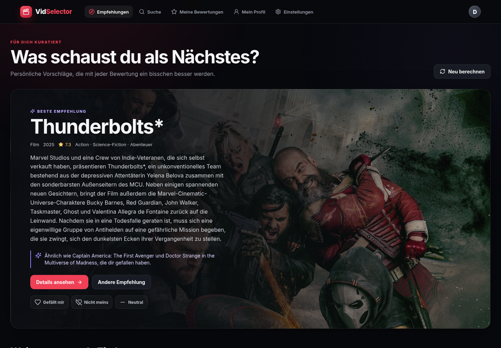

<p align="center">
  
</p>

<h1 align="center">VidSelector</h1>

<p align="center">
  <strong>Deine persönliche Film- und Serienauswahl – lokal, privat und nachvollziehbar.</strong>
</p>

<p align="center">
  <a href="https://github.com/DevMatze/VidSelector/actions/workflows/ci.yml"></a>
  
  
  
  
</p>

VidSelector ist eine lokale Einzelplatz-Web-App, mit der du Filme und Serien bewertest und daraus persönliche Empfehlungen erhältst. Es gibt keine Anmeldung, keine Werbung, kein externes Nutzertracking und keinen gehosteten VidSelector-Dienst. Dein Profil und deine Bewertungen bleiben in deiner eigenen SQLite-Datenbank.

> [!IMPORTANT]
> VidSelector ist ein persönliches, nicht-kommerzielles Hobbyprojekt. Es ist weder ein Streamingdienst noch eine öffentliche Mehrbenutzerplattform.

## Was VidSelector besonders macht

- **Eigene Bewertungen:** `Gefällt mir`, `Neutral` oder `Nicht meins`
- **Unabhängige Merkliste:** `Möchte ich sehen`, `Angefangen`, `Gesehen` oder `Abgebrochen`
- **Regelbasierte Empfehlungen:** nachvollziehbare Scores statt Black-Box-KI
- **Filme und Serien getrennt:** in jeder Kategorie, Suche und Bibliothek
- **Netflix-artige Navigation:** Karussells, dynamische Pfeile und eigene „Siehe mehr“-Seiten
- **Anime als eigene Facette:** japanische Animation wird von westlicher Animation unterschieden
- **Ausführliche Details:** Cast, Kreativteam, Laufzeit, Staffeln, Trailer und ähnliche Titel
- **Streaminghinweise für Deutschland:** getrennt nach Streamen, Mieten und Kaufen
- **Local-first Cache:** SQLite wird vor TMDB abgefragt
- **Lokale Datensicherung:** versionierter Export, validierter Import und automatische Backups
- **Demo-Modus:** direkt ohne API-Zugang testbar
- **Responsive UI:** für Desktop und Smartphone

## Vorschau



## So entstehen Empfehlungen

VidSelector trainiert kein KI- oder Machine-Learning-Modell. Die Empfehlungen entstehen lokal aus einer transparenten, regelbasierten Gewichtung:

```text
Bewertungen
   │
   ├── Genres und Anime-Facette
   ├── Originalsprache und Jahrzehnt
   ├── Cast und Kreativteam
   └── ähnliche positiv/negativ bewertete Titel
            │
            ▼
      gewichteter Score
            │
            ▼
   diversifizierte Empfehlungen
```

Öffentliche Bewertung, Stimmenanzahl und Popularität dienen als zusätzliche Qualitätssignale. Bereits bewertete Titel
werden ausgeschlossen; negative Muster senken den Score ähnlicher Kandidaten aktiv ab. Wiederholte Anzeigen, vorsichtig
gewichtete Klicks und ausdrücklich übersprungene Titel verbessern die Rotation, ohne eine echte Bewertung zu ersetzen.
Die zentralen Gewichte liegen in [`lib/recommendations/config.ts`](lib/recommendations/config.ts).

### Eindeutige Kategorien ohne Wiederholungen

- **Top-Auswahl für dich:** die stärksten gemischten Empfehlungen aus Film und Serie
- **Passende Filme:** weitere Filme außerhalb der Top- und Entdeckungsauswahl
- **Passende Serien:** weitere Serien außerhalb der Top- und Entdeckungsauswahl
- **Etwas Neues ausprobieren:** eigene Entdeckungstitel außerhalb der bisherigen Auswahl

Ein Titel wird auf der Startseite nur einer dieser Rubriken zugeordnet. Die zugehörigen „Siehe mehr“-Seiten verwenden
dieselbe eindeutige Aufteilung.

### Bewertung, Merkliste und Feedback

Eine Bewertung beschreibt deinen Geschmack. Der Wiedergabestatus verwaltet dagegen, ob du einen Titel erst sehen
möchtest, bereits angefangen, gesehen oder abgebrochen hast. „Nicht interessiert“ blendet nur den konkreten Vorschlag
aus und wertet nicht automatisch dessen gesamtes Genre ab.

### Anime oder Animation?

TMDB führt Anime nicht als eigenes Genre. VidSelector leitet die Facette deshalb nachvollziehbar aus zwei Merkmalen ab:

```text
Genre „Animation“ + Originalsprache Japanisch = Anime
```

So werden beispielsweise japanische Anime-Serien von westlichen Animationsproduktionen getrennt. Bei internationalen Koproduktionen kann diese bewusst einfache Heuristik abweichen.

## Schnellstart

### Voraussetzungen

- Node.js 20 oder neuer (CI verwendet Node.js 22)
- npm
- optional: kostenloser TMDB-API-Zugang für den vollständigen Katalog

### Installation

```bash
git clone https://github.com/DevMatze/VidSelector.git
cd VidSelector
npm install
cp .env.example .env
npm run setup
npm run dev
```

Öffne anschließend [http://localhost:3000](http://localhost:3000).

`npm run setup` wendet die Datenbankmigrationen an und erstellt ein kleines Beispielprofil. Für einen leeren Start genügt:

```bash
npm run db:push
```

## TMDB aktivieren

Ohne Zugangsdaten verwendet VidSelector automatisch den integrierten Demo-Katalog. Für den vollständigen Katalog:

1. Bei [TMDB API Settings](https://www.themoviedb.org/settings/api) einen API-Zugang erstellen.
2. `.env` öffnen und bevorzugt das v4 Read Access Token eintragen.
3. `DEMO_MODE=false` setzen und den Server neu starten.

```dotenv
TMDB_BEARER_TOKEN=
TMDB_API_KEY=
DATABASE_URL="file:./dev.db"
DEMO_MODE=false
```

Alternativ funktioniert der klassische `TMDB_API_KEY`. Beide Zugangsdaten bleiben ausschließlich auf dem Next.js-Server und gehören niemals in Git oder in einen Screenshot.

## Als lokaler Service betreiben

Nach dem Produktions-Build kann VidSelector als systemd-Benutzer-Service laufen:

```bash
npm run build
./scripts/install-service.sh
```

Danach stehen die üblichen Befehle zur Verfügung:

```bash
systemctl --user status vidselector
systemctl --user restart vidselector
journalctl --user -u vidselector -f
```

Der Service bindet ausschließlich an `127.0.0.1:3000` und ist damit nicht aus dem Netzwerk erreichbar.

## Lokaler Cache und Datenhaltung

| Inhalt                    |       Gültigkeit |
| ------------------------- | ---------------: |
| Suchergebnisse            |       24 Stunden |
| Detail- und Providerdaten |           7 Tage |
| allgemeine Mediendaten    |          30 Tage |
| TMDB-Inhalte insgesamt    | maximal 180 Tage |

Abgelaufene ungenutzte Medien werden gelöscht. Ist ein Titel weiterhin mit einer persönlichen Bewertung verbunden, bleibt die Bewertung erhalten, während abgelaufene TMDB-Metadaten entfernt und bei der nächsten Detailabfrage neu geladen werden. Damit bleibt dein eigenes Profil erhalten, ohne TMDB-Inhalte länger als sechs Monate zu cachen.

Nicht in Git gespeichert werden:

- `.env` und API-Zugangsdaten
- `prisma/dev.db` mit Profil und Bewertungen
- Build-, Coverage- und Testartefakte
- `node_modules`
- lokale Sicherungen unter `backups/`

## Export, Import und Backups

Unter **Einstellungen → Datensicherung** kannst du Profilname, Bewertungen und Merkliste als versionierte JSON-Datei
exportieren. Beim Import stehen Zusammenführen und vollständiges Ersetzen zur Auswahl. Vor einem Import oder einer
Profilrücksetzung legt VidSelector automatisch eine zusätzliche lokale Sicherung an.

`npm run db:push` erstellt außerdem vor jeder Migration eine konsistente SQLite-Sicherung. Die zehn neuesten
Datenbanksicherungen werden unter `backups/database` aufbewahrt; automatische Profilsicherungen behalten sieben
tägliche und bis zu vier ältere wöchentliche Stände. Diese Dateien verlassen deinen Computer nicht.

## Qualitätssicherung

```bash
npm run lint
npm run typecheck
npm run format:check
npm test
npm run test:coverage
npm run test:e2e
npm run build
```

GitHub Actions führt Linting, Typprüfung, Formatprüfung, Coverage, Produktions-Build sowie Desktop- und Mobile-Browsertests automatisch aus.

## Architektur

```text
app/                  Next.js-Seiten und interne API-Routen
components/           responsive React-Komponenten
lib/tmdb.ts           serverseitige TMDB-Integration
lib/media-cache.ts    Query-, Medien- und Detailcache
lib/data.ts           Prisma-Persistenz und lokales Profil
lib/recommendations/  Profilbildung, Ranking und Diversifizierung
lib/profile-transfer.ts versioniertes Export- und Importformat
lib/profile-backups.ts automatische lokale Profilsicherungen
prisma/               SQLite-Schema, Migrationen und Seed
tests/e2e/             Playwright-Smoke-Tests
deploy/                systemd-Servicevorlage
```

## Befehle

| Befehl                  | Zweck                                      |
| ----------------------- | ------------------------------------------ |
| `npm run dev`           | Entwicklungsserver starten                 |
| `npm run build`         | Produktions-Build erstellen                |
| `npm run start`         | lokalen Produktionsserver starten          |
| `npm run setup`         | Migrationen und Beispieldaten einrichten   |
| `npm run db:push`       | Prisma-Migrationen anwenden                |
| `npm run db:backup`     | konsistente SQLite-Sicherung erstellen     |
| `npm run db:migrate`    | Migration ohne zusätzlichen Backup-Schritt |
| `npm run db:seed`       | Beispielprofil anlegen                     |
| `npm run lint`          | ESLint ausführen                           |
| `npm run typecheck`     | TypeScript prüfen                          |
| `npm test`              | Unit-, API- und Komponententests ausführen |
| `npm run test:coverage` | Coverage-Bericht erstellen                 |
| `npm run test:e2e`      | Desktop- und Mobile-Browsertests ausführen |
| `npm run format`        | Dateien mit Prettier formatieren           |

## Datenschutz und Sicherheit

- keine Benutzerkonten oder Cloud-Synchronisation
- keine Analyse-, Werbe- oder Trackingdienste
- serverseitige TMDB-Authentifizierung
- Herkunftsprüfung für schreibende API-Anfragen
- Begrenzung API-intensiver Routen
- lokale, validierte Datenexporte und Sicherungen
- Security-Header und lokale Netzwerkbindung im Produktionsbetrieb

VidSelector ist ausdrücklich für einen lokalen Benutzer ausgelegt. Wer die Anwendung öffentlich erreichbar macht, muss vorher eine echte Authentifizierung, einen geeigneten öffentlichen Betrieb und eine eigene Sicherheitsprüfung ergänzen.

Sicherheitsprobleme bitte nicht als öffentliches Issue melden. Hinweise stehen in [`SECURITY.md`](SECURITY.md).

## Entwicklungstransparenz

VidSelector wurde mit Unterstützung generativer KI, insbesondere **OpenAI Codex**, konzipiert, programmiert, getestet
und dokumentiert. Architekturentscheidungen, Auswahl der Änderungen, fachliche Prüfung und Verantwortung für den
veröffentlichten Stand liegen beim Maintainer. Das Empfehlungssystem selbst verwendet keine generative KI und sendet
keine persönlichen Geschmacksdaten an einen KI-Dienst.

Alle veröffentlichten Änderungen sind im [`CHANGELOG.md`](CHANGELOG.md) nachvollziehbar.

## Datenquellen, Marken und rechtliche Hinweise

This product uses the TMDB API but is not endorsed or certified by TMDB.

Film- und Seriendaten sowie zugehörige Bilder stammen von [The Movie Database (TMDB)](https://www.themoviedb.org). Das in der Anwendung verwendete TMDB-Logo ist ein offizielles, unverändertes Logo und wird weniger prominent als die eigene VidSelector-Kennzeichnung dargestellt.

Informationen zur Streaming-Verfügbarkeit werden über TMDB bereitgestellt und stammen aus der Partnerschaft mit **JustWatch**. Verfügbarkeiten können sich ändern; VidSelector verlinkt für weitere Informationen auf die von TMDB gelieferte Seite.

Die Nutzung der TMDB-API unterliegt jederzeit den aktuellen [TMDB API Terms of Use](https://www.themoviedb.org/api-terms-of-use). Jede Person, die eine eigene Instanz betreibt, benötigt eigene TMDB-Zugangsdaten und ist selbst für die Einhaltung dieser Bedingungen verantwortlich. Eine kommerzielle Nutzung ist durch dieses Projekt nicht vorgesehen und kann eine separate schriftliche Vereinbarung mit TMDB erfordern.

VidSelector bietet selbst keine Filme, Serien oder Streams an. Alle Marken, Titel, Bilder und sonstigen Inhalte verbleiben bei ihren jeweiligen Rechteinhabern.

## Lizenz

Der Quellcode ist öffentlich einsehbar, aber nicht als Open Source lizenziert. Es gilt [`LICENSE.md`](LICENSE.md): **All Rights Reserved**.

Copyright © 2026 DevMatze.
